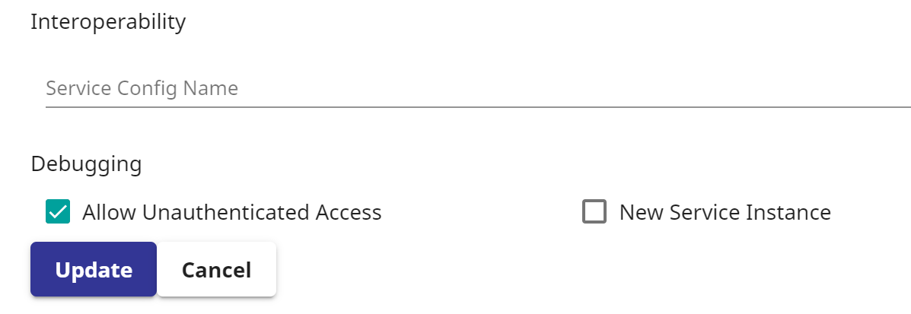
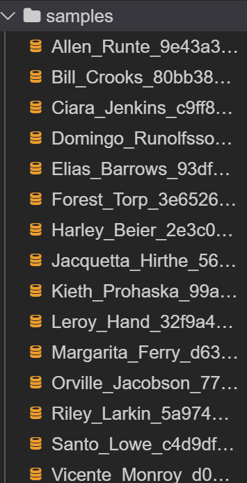
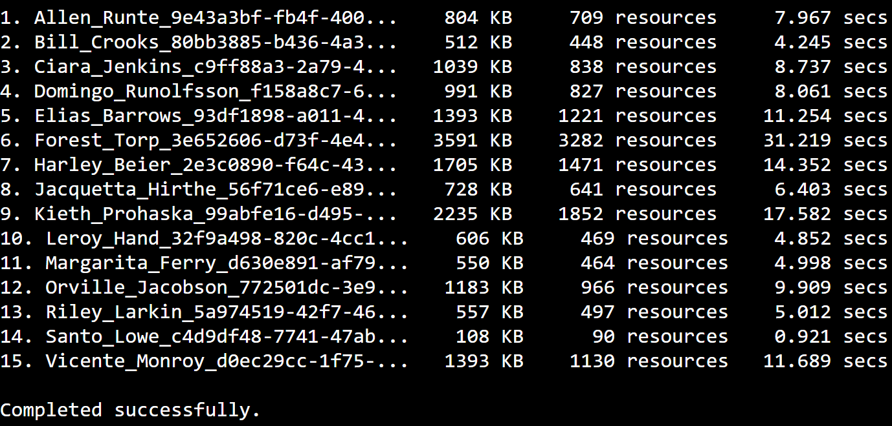
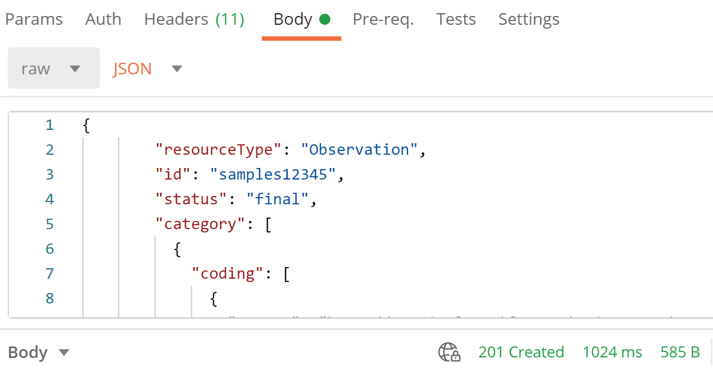
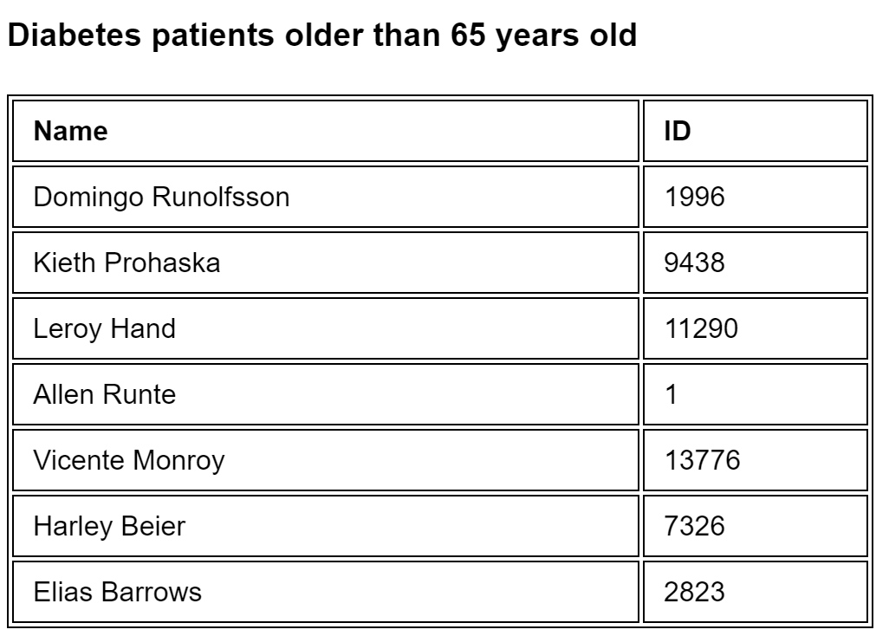

 <header>
Working with the FHIR Resource Repository
=========================================
</header>
<main>

# Introduction

InterSystems IRIS for Health™ provides a base FHIR® server implementation with an internal FHIR resource repository for storing and managing FHIR resources. In this lab, you will set up a FHIR R4 server with a resource repository, populate the repository with realistic sample patient data, and construct a simple FHIR client app that can interact with the server via FHIR RESTful API.

# Goals

By the end of this exercise, you should be able to:

*   Set up a FHIR resource repository using InterSystems IRIS for Health™
*   Use the open-source Synthea™ tool to generate synthetic patient data
*   Use a REST client to manually interact with the FHIR server via FHIR RESTful API
*   Set up a simple web-based FHIR app to retrieve and display data from the FHIR repository

> ---
> This exercise requires the use of either the **Google Chrome** browser (preferred) or Mozilla Firefox to access certain web pages that are no longer supported by Internet Explorer. 
> 
> ---

# Instructions

## Set Up a FHIR R4 Server with a Resource Repository

InterSystems IRIS for Health includes an installer method for creating a FHIR server namespace. In the exercise, we will use this method to create a brand new namespace called `FHIRSERVER` where we will set up a FHIR R4 server.

1.  Select **InterSystems** > **Web Terminal** from the drop-down menu at the top of the IDE to open InterSystems Terminal. Supply *tech* and *demo* for credentials. Run the following command to create a new IRIS for Health namespace called `FHIRSERVER`:

    `do ##class(HS.HC.Util.Installer).InstallFoundation("FHIRSERVER")`

2.  When the command finishes running, open the Management Portal from the IDE by selecting **InterSystems > IRIS Management Portal** from the drop-down menu at the top and supply the credentials *tech* and *demo*. Terminal will be used again in the next section, so please do not close the Terminal window. 

3. From the Management Portal homepage, switch to the `FHIRSERVER` namespace and navigate to **Health** > **FHIR Configuration** > **Server Configuration** to set up a new FHIR R4 endpoint that stores FHIR data as JSON in a FHIR resource repository. Click the plus sign (**+**) and enter the following settings. You might have to wait several minutes for the endpoint to be created.

    - **Metadata** : *HL7v40*
    - **Interaction strategy**: _HS.FHIRServer.Storage.Json.InteractionsStrategy_
    - **URL** : _/csp/healthshare/fhirserver/fhir/r4_

4. Click the `/csp/healthshare/fhirserver/fhir/r4` endpoint and **Edit**, then select **Allow Unauthenticated Access** and click **Update**.


## Populate the Repository with Synthetic Patient Data

In this section, we will populate the `FHIRSERVER` resource repository with realistic patient data generated by Synthea™. This synthetic patient generator produces JSON files, each of which is a FHIR bundle containing various FHIR resources, such as Patient, Condition, Medication and Observation.

> ---
> Synthea™ is an open-source tool that generates synthetic patient data and medical history, providing high-quality, realistic patient data and associated health records. For more information, see the [Synthea website](https://synthetichealth.github.io/synthea) on GitHub.
>
> ---

Fifteen synthetic patients (15 JSON files) have already been pre-generated for this exercise, and we will use these samples to populate the FHIR R4 resource repository of `FHIRSERVER`. As an optional step at the end of this exercise, you can try installing the Synthea patient generator on your computer and create your own synthetic patients. 

IRIS for Health provides a utility method that allows you to directly submit multiple FHIR bundles to the resource repository just by specifying the location of a directory where sample files are found. To load the synthetic patient data into the resource repository: 

1.  Locate the pre-generated FHIR bundles (JSON files) under the `/shared/samples` directory in the server container, accessible through the integrated IDE.




2.  Expand the **samples** folder and double-click the first sample file, `**Allen_Runte_9e43a3bf-fb4f-4007-8a1f-d8e00e57d4e5.json**`, to see what a bundle of FHIR resources looks like in JSON.

3.  From the Web Terminal, switch to the `FHIRSERVER` namespace created in the previous section:

    `HSLIB> set $namespace = "FHIRSERVER"`

4.  Execute the following command, making sure to specify the correct input directory location as shown. The command may take a while to load all 25 bundles, which are relatively large.

    `FHIRSERVER> set sc = ##class(HS.FHIRServer.Tools.DataLoader).SubmitResourceFiles("/home/project/shared/samples","FHIRSERVER","/csp/healthshare/fhirserver/fhir/r4")`

5.  When the command finishes running, check the console to ensure that all 15 synthetic patients have been loaded successfully.



## Use a REST Client to Search and Update Patient Data in the FHIR Repository

In this section, we will use a REST client to manually interact with FHIR server via FHIR RESTful API. InterSystems IRIS for Health supports all client/server interactions defined under the FHIR specification, including `create`, `read`, `update`, `delete`, and `search`. Let's start by searching for a patient named Ciara Jenkins.

### Search for Patient Data in the FHIR Resource Repository

1. First, open your REST client and complete the fields with the following values: 

**Headers** :

- **Accept**: *application/fhir+json*
- **Content-type**: *application/fhir+json*

**HTTP Request** : `GET http://localhost:52773/csp/healthshare/fhirserver/fhir/r4/Patient?family=Jenkins&given=Ciara`

2. Submit the request and examine the response payload bearing Ciara Jenkins's Patient resource in a FHIR bundle and confirm that her ID is *1158*.

3. You can get any other information about Ciara, including related resources such as AllergyIntolerance and Encounter, by adding `$everything` to the end of your URL:

`http://localhost:52773/csp/healthshare/fhirserver/fhir/r4/Patient/1158/$everything`

### Update Patient Data in the FHIR Resource Repository

Using the following steps, update Ciara’s data by creating a new Observation resource using the provided sample observation input corresponding to Ciara’s BMI  [kg/m2],  recorded after a recent test:

  1. Change the HTTP request to `POST http://localhost:52773/csp/healthshare/fhirserver/fhir/r4/Observation`.
  2. In the file explorer panel of your IDE, locate and open `NewObservation-Ciara.json` under the `/etc` directory.
  3. Make note of the following:
   
     * LOINC code (*39156-5*) corresponding to BMI 
     * Observation date (effectiveDateTime = *2020-08-15T10:55:05-04:00*)
     * BMI value (valueQuantity.value = *26.85*) indicated in the sample input.
  4. Copy the entire JSON content of this sample input file and paste it into the **Body** section of your REST Client window.
  5. Submit the request and verify that a *201 Created* response is returned from the server, indicating a successful creation and storage of the new Observation resource.



To confirm that the resource was created, perform a search to retrieve the newly added Observation resource by changing the HTTP request to:

`GET http://localhost:52773/csp/healthshare/fhirserver/fhir/r4/Patient/1158/Observation?code=39156-5&date=2020-08-15`

## Construct a Simple FHIR Client App

In this section we will connect a sample FHIR client app to our FHIR server repository to display patient data on a webpage. This sample app allows a user to identify diabetes patients and plot their BMIs on a chart.

1.  Let's start by opening the sample app file in the IDE: `/FHIRLab/app/FHIRApp.html`.

> ---
> The sample FHIR app (`FHIRApp.html`) is a simple JavaScript-based webpage that internally performs the following two queries against the FHIR server:
>
>(1)  `https://hostname:port/csp/healthshare/fhirserver/fhir/r4/Patient?_has:Condition:patient:code=15777000&birthdate=lt1955-01-01&_sort=-birthdate&_count=7`
>*  This query returns the seven oldest diabetes patients older than 65.
>*  Here `code=15777000` refers to the SNOMED-CT code for Diabetes.
>*  This search uses the `_has` parameter, allowing users to perform a search with reverse chaining. In this case, the search is looking for any patient who has at least one Condition resource whose code corresponds to Diabetes. For more information on chained parameters and reverse chaining, please see this [HL7 FHIR web page](https://www.hl7.org/fhir/search.html#has).
>*  The `birthdate=birthdate=lt1955-01-01` parameter uses a comparison operator `lt` (less than) to find patients older than 65 (in this example, patients born in or before 1955). Other comparison operators are `le` (less than or equal to), `gt` (greater than) and `ge` (greater than or equal to).
>*   `_sort` is a standard parameter for sorting, with the optional minus sign (-) prefix indicating decreasing order.
>*   `_count` is a standard parameter for specifying how many results are to be returned by the FHIR server in a single page.
>
>(2)  `https://hostname:port/csp/healthshare/fhirserver/fhir/r4/Patient/x/Observation?code=39156-5&_sort=date`
>*  This query returns all BMI observations for patient x, sorted by observation date in increasing order.
>*  As mentioned previously, `code=39156-5` refers to the LOINC code for BMI.
> ---

> ---
> Please note that the sample app makes direct use of the following two free, open source JavaScript libraries, plus some custom JavaScript code to build out the webpage:
> *   `jqFhir.js`: This is a [jQuery](https://jquery.com/)-based implementation of the `fhir.js` library, which provides a simple FHIR client module for performing basic CRUD (`create`, `read`, `update`, and `delete`) operations. Please see [the FHIR.JS page on GitHub](https://github.com/FHIR/fhir.js) for more information.
> *  `plotly-latest.min.js`: [Plotly](https://plot.ly/javascript/) is a data-visualization library, which our sample app uses to graph patient hemoglobin data on a chart.
> ---

2. Modify the `baseUrl` parameter in the line 44 to make the client point to your FHIR server's FHIR R4 endpoint by setting baseUrl to `http://localhost:52773/csp/healthshare/fhirserver/fhir/r4`.

3. Scroll down to `client.search()`, which performs a search for pre-diabetes patients. Follow the instruction to uncomment the two lines to narrow the search down to diabetes patients older than 65 years old. Press **Ctrl**+**S** to save the file.

```
client.search({
 type:'Patient',
 query: {
    '_has:Condition:patient:code':'15777000',
    // Uncomment the following two lines
    // birthdate: 'lt1955-01-01',
    // _sort:'birthdate',
    _count: 7
```

4. Open the FHIR App webpage by right-clicking **/FHIRLab/app/FHIRApp.html** and clicking **Open With** > **Preview**. Notice in the URL that this is the page you were just editing, and it displays a list of seven patients.
 

5. Supply the ID for Elias Barrows to chart his BMI observation values. How is Elias doing?

6. (Optional) **Challenge**: Glucose level is also an important factor for diabetes patients. Modify `FHIRApp.html` to chart Elias's observation values of his glucose level (LOINC 2339-0). Note that the value range for glucose is 60–100 mm/dL. See `FHIRAppSolution.html` for the solution.

## (Bonus) Generate Your Own Synthetic Patients

In this section you will download and install the Synthea patient generator on your computer and produce your own synthetic patients as FHIR R4 resources.

> ---
> Synthea's patient generator requires that Java (JDK) 8.0 or higher be installed on your computer. If needed, please install [Java](https://www.oracle.com/technetwork/java/javase/downloads/index.html) before proceeding.
> 
> ---

1. Clone [Synthea's GitHub page](https://github.com/synthetichealth/synthea) to your local machine.

2. Open `synthea.properties` found under `/synthea/src/main/resources`.

3. Set the following properties so that the tool can generate FHIR R4 resources (the latest version of Synthea produces FHIR R4 resources by default). Then, click **Save**.

    - `exporter.csv.export = true`
    - `generate.append_numbers_to_person_names = false`

	
    > ---
    > Setting `exporter.csv.export` to *true* instructs the tool to produce CSV files corresponding to the FHIR resources generated. This can be useful because it allows users to view data for all patients in table format.
	> 
    > Setting `generate.append_numbers_to_person_names` to *false* disables the default behavior of adding random numbers to patient names. Removing the numbers makes the synthetic data more realistic.
	>
    > ---

4. Open the Terminal on your computer and navigate to the `synthea` directory you recently cloned, then execute the following command:

    `./run_synthea`

5. Using your computer's file browser, navigate to the `/synthea/output/fhir` directory, which now contains JSON files for the patient data just generated.

6. Using the IDE, create a new `test` folder by selecting the `FHIRLab` folder and then going to **File** > **New Folder**. Then, copy the generated files and make them available on the server container by dragging all the JSON files under `/synthea/output/fhir` in your computer into the new `test` folder in the IDE.

7. Submit your sample files into `FHIRSERVER` by repeating the relevant steps in the section *Populate the Repository with Synthetic Patient Data*, starting at Step 4. Be sure to set the source directory to `/home/project/FHIRLab/test`.

8. Try accessing your new patients by performing a query from a REST client or by further tweaking the internal queries of the sample FHIR app.

## Summary

In this exercise, we used InterSystems IRIS for Health to set up a FHIR server with an internal FHIR repository and loaded the repository with synthetic patients. You then saw how the server interacts manually with client applications through a REST client and how it operates through a simple FHIR app. Feel free to continue experimenting with the FHIR resource repository by adding more data or setting up your own application.
</main>